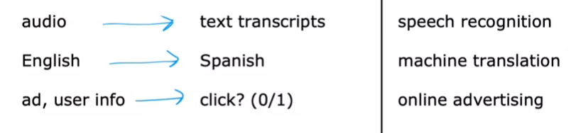
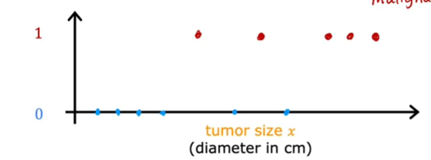
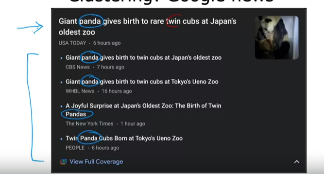
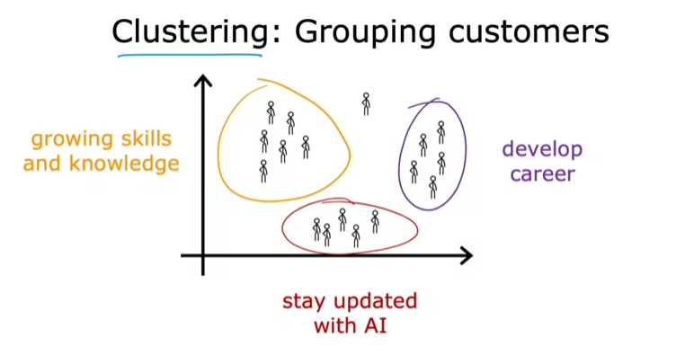
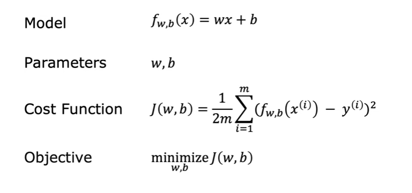
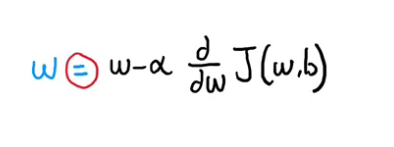
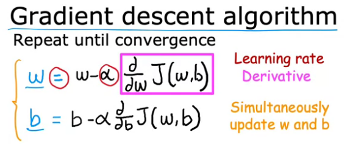
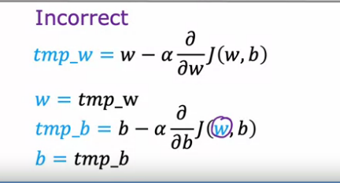
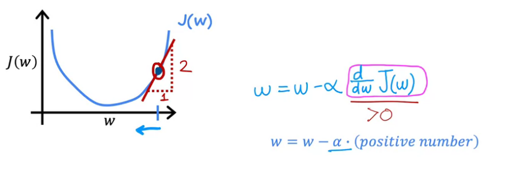
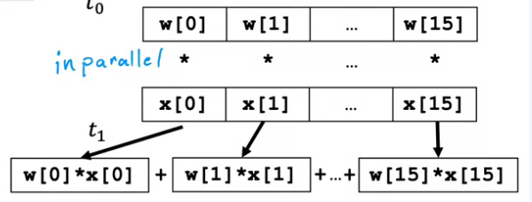

# MachineLearning-course-by-AndrewNg
This repository contains my journey with the machine learning course by  AndrewNg from `coursera.com`
* sorry for my english descriptions 
# Chapter 1  **Supervised machine learning - Regresion and Clasification**
## What is machine learning?
>"Field of study that gives computers the ability to learn withour being explicitly programed" ~ Arthur Samuel (1959)

Because the computer gets posibilities to train the model all the time makes it easier to understand for himself the way for example to be better player at checkers. 
>"Training 10 times is less efficient than training 10000times and find your mistakes"

**Types of machine learning:**

* Supervised learning - (1st and 2nd part of the course)
* Unsuperviesed learning - (3-rd part of the course)
* Recommender systems
* Reinforcement learning

>Firsty you need to get set of tools and later on you will be able to study a way to efficient use of these. 

## Supervised learning 1

You give your learning algorithms inputs and outputs. By use this data algorithm learns from being given `right answers`

**Examples**

or 


### Regresion
When we are trying to predict optimal price for house based on size we can build the model which is using [x,y] => [size, price] to predict the price for every given size. Jutro like linear regresion ` y = ax+b` the algorithm is looking for `a` which is `arctan(y/x)`. After all calculations algorithm is making streight line, basing on this line we can predict the "optimal price" for a house based on it size.

**Regresion** - trying to predict a number infinitely many possible outputs.

## Supervised learning 2

### Classification
**Example** : breast cancer detection
We are making algorithm which is using clasiffication to look for malignant(really bad) or benign(not that bad) bazed on his size. \\
Plan:
* **Data Collection**: Gather medical records, including tumor characteristics.
* **Training**: The machine learning model is trained on labeled data, learning to differentiate between benign and malignant tumors.
* **Prediction**: For new patients, the model predicts the tumor class based on the input features.


**Classification** :
* predict categories of the tumor, using  0,1,2. 
* have small number of possible outputs.

### Two and more inputs
If we want to use more inputs for example 2 and now we use [[size, age],[diagnosis]] we are able to make more accurate model in making diagnosis.

### Sumary
**Supervised learning** maps the input `x` to the output `y`:
* learns from being given `right answers`

**Main types of supervised learning** : 
* regression - predict the numbers of infinitly many possible outputs
* Classification - predict categories of the small number of possible outputs. 

# Chapter 2
Hello cuties papoties today we gonna learn about (pls dont be scared) unsupervised learning method. POGCHAMP
## Unsupervised Learning part 1
Most used type of learning is the unsupervised learning. Is super just like supervised learning. hi hi. The main change is that (basing on the last example with tumor) we dont tell for algotith what is what. Algorithnm is just grouping the data in clusters thats why the main unsupervised Machine learning algorithm is called Clustering instead of ... idk somehthing else. 

Example of this algorithm is google news articles. They group the articles based on the similar data/words/dates in this articles that may be related one to another. 


Algorithm is finding words which exist simultaniously in every news, later on is just clustering these words  togther in groups or clusters. again idk how to call it exacly, but I'm trying okay???

MR. ANDREW SAID THAT THERE IS NOT EVEN ONE EMPLOYE IN GOOGLE WHO IS JUST  GROUPING THE WORDS IN NEWS FR??? 

**Unsupervised learning pros**
* you dont need to know what is what, all you need is for your data to have some specific features <numbers, words ... and so on>

### Clustering - grouping customers
Basing on given data (hobby of customers) the algorithm gives us the clusters of customers. 


## Unsupervised learning part 2

In unsupervised learning data only comes with inputs `x` but not outputs with labels `y`. Algorithm has to find structure in the data.

* Clustering :
    * group similar data
    * points together
* Anomaly detection
    * finds unusual data points
* Dimensionality reduction (we dont know what is this yet but we will eventually in the future)
    * Compress data using fewer numbers

## Jupyter Notebook 
 i use:
 * python 3.12.4
 * miniconda 3
 * [Jupyter testbook 1](ml_course.ipynb)

this program makes work with machine learning easier because you can work with every line of code and its easier to understand your work. 

# Linear regression model

## Linear regression model part 1
**Problem**: make prediction about price of the house basing on the size of the house. 

We will use: 
* Regresion model for predicting numbers

In this dataset, we get size in feet^2 and price of house in $1000's 

Notation is: 
* `x` = input variable feature (size of house)
* `y` = output variable, target variable (price of house)
**Single example** = (`x`,`y`)
**Training example** = (`x_(i)`, `y_(i)`) the i-th example (1nd, 2nd, 3rd, etc)


## Linear Regression model part 2 
 To build linear regression model, we need to have the following:
 * training set - it has features and targets needed to train our model our (x,y) pairs
 * then we go to learning algorithm 
 * f = our function  which is using new `x` to give us the  new `y` (or `y` with hat  is our prediction )based on the training data we done earlier. 

 `x` is called feature, `y` is called prediction (target)

for model on house price it will look like this:

**zise --> f --> price (estimated)**

### How to represent f? 

its asy bruhs:  `y = ax +b `, y(x)= ax+b

### Why we use linear  function when we want to draw streight line?
Because its relatyvley easy to work with, 

go to [JUPYTER NOTEBOOK 2](ml_course2.ipynb), I forgot to install a lot of libraries on this machine. womp womp situation fr. 

I had problem with vsc couse it didnt saw a packeges I installed. Solving of this problem was to install them by using the terminal,  in vsc not in anaconda cmd crazy moment sorry I didnt know, but now I do. 

## Linear regression - Cost Function
There is nothing important to do here, just simple math equations you can find it in the internet. 

Next video is about the visualisation of the cost function. 

# Visualisation examples
Optional Lab: 
[other notebook](ml_course3.ipynb)
Shows how to calculate the cost function and how to visualize with matplotlib, useful. thanks andrew uwu ng. 


# Gradient Descent
UUUUUUUUUUUUUUU POGCHAMP REAL MATH  INCOMIUNG.
>pop smoke - dior is blasting rn

## Gradient Descent algorithm 


alfa - learning rate, how big step we take with learning



Learning rate is always a positive number!!!!!!!!!

i dont think that I need to show you what a tan(x) is???. 

NOW WE KNOW:

**Bias** is like a personal opinion or belief that a machine learning model has. It's like when you have a hunch or a gut feeling about something, even if you don't have any evidence. In machine learning, bias helps the model make predictions even when there's no input data. It's like the model's default guess or tendency.

**Weights** are like the importance or relevance that the model gives to different factors when making predictions. It's like when you consider some things more important than others when making a decision. In machine learning, weights are used to combine the input data in a smart way. Each input gets multiplied by its weight, and the results are added up to make a prediction.

I MADE CODE WITH GRADIENT  -----> [simple gradient code](gradient.py) <-----

# Learning rate parameter.

lab 4  -----> [lab 4](ml_course4.ipynb) 
## 1. The Gradient Descent Rule
The gradient descent update rule is given as:

$W = W - \alpha \frac{\partial J(W, b)}{\partial W}$

Where:
- **𝛼** is the learning rate.
- $\frac{\partial J(W, b)}{\partial W}$ is the derivative of the cost function.

## 2. What Happens if the Learning Rate is Too Small?
If the learning rate is too small (e.g., 𝛼 = 0.0000001), gradient descent takes **tiny baby steps**. Each step decreases the cost \( J \), but very slowly:
- You start at some point on the cost function graph, and gradient descent takes **very small steps** toward the minimum.
- This results in slow convergence, requiring **many iterations** to reach the minimum.

## 3. What Happens if the Learning Rate is Too Large?
If the learning rate is too large, gradient descent might **overshoot** the minimum:
- You start near the minimum, but instead of taking a small step, gradient descent takes a **huge step**, overshooting the minimum.
- Each subsequent step moves further away from the minimum, causing the cost to increase, and the solution may **diverge**.

## 4. What Happens if W is Already at the Minimum?
If your parameter $ W $ is already at a local minimum, gradient descent does nothing:
- At the local minimum, the **derivative is zero**, so the update rule becomes:
  
  $W = W - \alpha \cdot 0 = W$
  
- Gradient descent leaves $ W $ unchanged, which is what we want at a minimum.

## 5. Automatically Taking Smaller Steps
As you get closer to the minimum, the **derivative** becomes smaller, leading to **smaller update steps**:
- Even with a fixed learning rate, gradient descent naturally takes smaller steps as you approach the minimum.
- This allows gradient descent to converge to the local minimum.


# **Gradient descent for linear regression.**
## Gradient Descent Algorithm
The gradient descent algorithm helps us find the values of **w** and **b** that minimize the cost function $J(w, b)$. The update rules for **w** and **b** are derived using calculus.

1. **Update rule for $w$:**
   
   $w := w - \\alpha \\cdot \\frac{\\partial J(w,b)}{\\partial w} $

   Where the partial derivative of the cost function with respect to \(w\) is:

   $\frac{\\partial J(w,b)}{\\partial w} = \\frac{1}{m} \sum_{i=1}^{m} \left( f(x^{(i)}) - y^{(i)} \\right) \cdot x^{(i)}$

2. **Update rule for $b$:**

   $b := b - \\alpha \\cdot \\frac{\\partial J(w,b)}{\\partial b}$

   Where the partial derivative of the cost function with respect to \(b\) is:

   $\frac{\\partial J(w,b)}{\\partial b} = \\frac{1}{m} \sum_{i=1}^{m} \left( f(x^{(i)}) - y^{(i)} \\right)$

### Why These Formulas?
These formulas come from taking the derivatives of the cost function. If you’re familiar with calculus, the 1/2 in the cost function was chosen to simplify the derivative formulas, as the "2" from the squared term cancels out. The key takeaway is that these derivatives give us the direction in which we need to adjust **w** and **b** to minimize the cost function.

### Gradient Descent Steps
Gradient descent works by updating **w** and **b** simultaneously until the values converge to the global minimum of the cost function. Here’s the process in short:

1. Initialize **w** and **b** to some values.
2. Compute the partial derivatives $\frac{\\partial J(w,b)}{\\partial w}$ and $\frac{\\partial J(w,b)}{\\partial b}$
3. Update **w** and **b** using the gradient descent update rules.
4. Repeat the process until convergence, i.e., until the cost function stops changing significantly.

### Convex Cost Function and Global Minimum
When you're using the squared error cost function with linear regression, the cost function will always be a convex function. This means it’s shaped like a bowl and has a single global minimum. Because of this property, gradient descent is guaranteed to converge to this global minimum, as long as the learning rate **α** is chosen properly.


# Running gradient descent

Gradient descent is an iterative optimization algorithm used to find the minimum of a function. In the context of linear regression, this function is the cost function which measures the difference between the predicted values and the actual values.   

## How it works:
- Initialization: We start with an initial guess for the parameters (slope, w, and y-intercept, b) of the linear equation.
- Calculate the gradient: The gradient points in the direction of the steepest ascent of the cost function at the current point.
- Update parameters: We update the parameters in the opposite direction of the gradient, taking a small step towards the minimum of the cost function. This step size is determined by the learning rate.
- Repeat: Steps 2 and 3 are repeated until the algorithm converges to a minimum or a maximum number of iterations is reached.
- Mathematical representation:
The linear equation is represented as:

$y = wx + b$

The cost function (often mean squared error) is:

$J(w, b) = 1/2m * Σ(y_{pred} - y_{actual})^2$

where:

m is the number of training examples
$y_{pred}$ is the predicted value
$y_{actual}$ is the actual value
The gradient descent update rule is:

$w = w - α * \frac{∂J}{∂w}$

$b = b - α * \frac{∂J}{∂b}$
where:

$α$ is the learning rate
## Batch Gradient Descent
In batch gradient descent, the gradients are computed using all the training examples in the dataset. This ensures that the updates are made in the direction that minimizes the overall cost function.

**Advantages**:

- Guarantees convergence to the global minimum for convex cost functions.
- Provides a good understanding of the optimization process.

**Disadvantages**:

Can be computationally expensive for large datasets.


# REGRESSION WITH MULTIPLE INPUT VARIABLES
week 2 pogchampo 
## Multible features (variables)
for example we have:
- size (x1)
- number of bedrooms (x2)
- number of floors (x3)
- age of home in years(x4)
- and price obv(x5)

NOW WE HAVE MORE THAN TWO VARIABLES. WHAT WE GONNA DO !!!!! :fearful:

>You are safe bby girl, daddy Andrew will show you the way.

Our model will look like this: 

$f_{w,b}=w_1x_1+w_2x_2+w_3x_3+w_4x_4+w_5x_5+b$

# VECTORIZATION 
## Vectorization part 1

PARAMETERS AND FEATURES

$\vec{w} = [w_1 , w_2 , w_3]$ n=3

b is a scalar (number)

$\vec{x}=[x_1 , x_2 , x_3]$

Linear algebra: count from 1 

```python
import numpy as np
w = np.array([1.0,2.5,-3.3])
b = 4
x = np.array([10,20,30])
print("1st element of w array is w[0]", w[0])
```
code counts from 0 

### Withour vectorization (mid option ):
:sad:

$f_{w,b}(\vec{x})= w_1x_1+w_2x_2+w_3x_3+b$

```python
f = w[0] * x[0] +
    w[1] * x[1] +
    w[2] * x[2] + b
```
```python 
f = 0 
for i in range(0,n):
    f = f + w[i] * x[i]
f = f+b
print(f)
```
### Vectorization(pogchamp option)
$f_{w,b}(\vec{x})= \vec{w} * \vec{x} +b$

```python
f = np.dot(w,x)+b #DOT PRODUCT OF TWO VECTORS
```

## Vectorization part 2
ANDREW WILL TELL US HOW VECTORIZED IMPLEMENTATION MAY WORK ON MINE COMPUTER (Don't brace yourselves maybe yours too )

### Without Vectorization 
lets look at this for loop
```python

for i in range(0,16):
    f = f + w[i] * x[i]

```
do this for every single index but with vectorization (next episode)

### WITH VECTORIZATION 

```python
np.dot(w,x)
```
EVERYTHING IS DONE AT THE SAME TIME PARALLEL TO EACHOTHER


next lab will be banger see you soon. 

