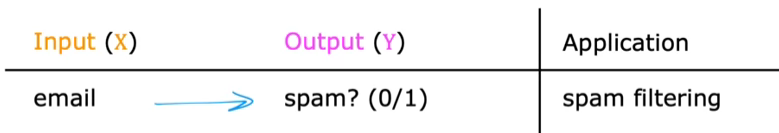
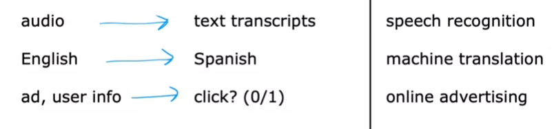

# MachineLearning-course-by-AndrewNg
This repository contains my journey with the machine learning course by  AndrewNg from `coursera.com`
# Chapter 1  **Supervised machine learning - Regresion and Clasification**
## What is machine learning?
>"Field of study that gives computers the ability to learn withour being explicitly programed" ~ Arthur Samuel (1959)

Because the computer gets posibilities to train the model all the time makes it easier to understand for himself the way for example to be better player at checkers. 
>"Training 10 times is less efficient than training 10000times and find your mistakes"

**Types of machine learning:**

* Supervised learning - (1st and 2nd part of the course)
* Unsuperviesed learning - (3-rd part of the course)
* Recommender systems
* Reinforcement learning

>Firsty you need to get set of tools and later on you will be able to study a way to efficient use of these. 

## Supervised learning

You give your learning algorithms inputs and outputs. By use this data algorithm learns from being given `right answers`

**Example**

or 

